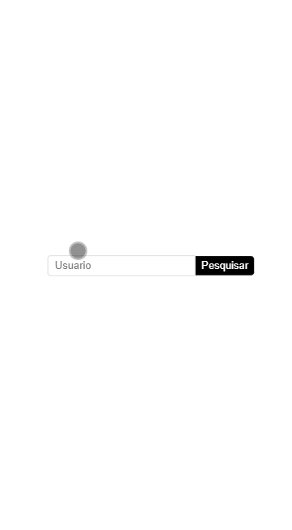

## A aplicação
A aplicação tem um funcionamento bastante simples: na página inicial, o usuário insere um nome de usuário do Github. A aplicação, por sua vez, busca por esse usuário, recupera seus repositórios e os exibe numa outra página.

#### Tela inicial da aplicação, na qual ocorre a busca pelo usuário do Github.
<br>
 


#### Tela onde são exibidos os repositórios do usuário pesquisado.
<br>
 
 <br>
 <br>
 
 ### GIF versão mobile de busca e resultado.
<br>

 

#### Motivação
Abordar e aprofundar nos conceitos de 
- Hooks;
- Componentes;
- Propriedades;
- Estado;
- Rotas (com react-router-dom);
- Requisições a APIs externas (com express);
- Eventos;
- Estilização (com styled-components);
- Lidando com erros e experiência do usuário;


##### Para usar a aplicação, basta executar os seguintes comandos na raíz do projeto:
```
npm install
npm start
```
